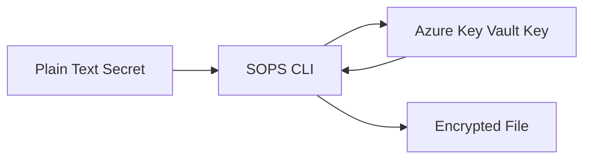
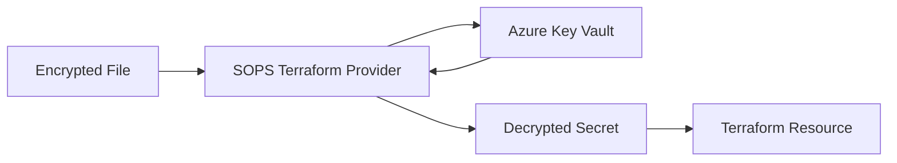

# SOPS (Secrets OPerationS) with Terraform Demo

## Overview

This demo demonstrates how to use SOPS (Secrets OPerationS) to securely encrypt secrets at rest while still allowing Terraform to decrypt and use t### Alternative Approaches

### 1. Azure Key Vault Direct Integration
```hcl
data "azurerm_key_vault_secret" "admin_password" {
  name         = "admin-password"
  key_vault_id = data.azurerm_key_vault.example.id
}
```

### 2. Environment Variables
```bash
export TF_VAR_admin_password="SecretPassword"
terraform apply
```

### 3. Terraform Cloud/Enterprise Variables
- Store secrets in Terraform Cloud workspace variables
- Mark as sensitive to prevent exposure in logs

## Why Use Storage Account for This Demo?

The demo uses an Azure Storage Account instead of a database to demonstrate SOPS functionality because:

1. **Universal Availability**: Storage accounts are available in all Azure regions and subscription types
2. **Simple Setup**: No complex configuration or version compatibility issues
3. **Clear Demonstration**: Using the secret in a resource tag clearly shows the decryption working
4. **Focus on SOPS**: Keeps the focus on the secret management rather than database administration

The SOPS concepts and security considerations remain exactly the same regardless of which Azure resource consumes the secret.ucture deployment. SOPS provides a secure way to store secrets in version control by encrypting them with cloud-based key management services.

## What is SOPS?

SOPS is an editor for encrypted files that supports various formats (JSON, YAML, dotenv, etc.) and integrates with multiple key management systems including:
- AWS KMS
- Azure Key Vault
- Google Cloud KMS
- PGP
- Age

In this demo, we use Azure Key Vault as the encryption backend.

## How It Works

### 1. Encryption Process


1. **Plain text secret** is created (e.g., `adminpassword.json`)
2. **SOPS encrypts** the file using an Azure Key Vault key
3. **Encrypted file** is generated (e.g., `adminpassword.enc.json`)
4. Only the encrypted file is committed to version control

### 2. Decryption Process (Terraform)


1. **Terraform SOPS provider** reads the encrypted file
2. **Authenticates** with Azure Key Vault
3. **Decrypts** the secret in memory
4. **Uses** the decrypted value in Terraform resources

## Demo Components

### Files in this Demo

- `adminpassword.json` - Original unencrypted secret file (not committed to git)
- `adminpassword.enc.json` - SOPS encrypted version (safe to commit)
- `main.tf` - Terraform configuration using the encrypted secret
- `variables.tf` - Terraform variable definitions
- `defaults.tf` - Provider configurations including SOPS provider
- `.gitignore` - Prevents committing unencrypted secrets

### Infrastructure Created

- **Resource Group**: Contains the demo resources
- **Storage Account**: Uses the encrypted secret in a resource tag to demonstrate SOPS functionality
- **Random String**: Generates a unique suffix for the storage account name

## Prerequisites Setup

### 1. Install SOPS
```bash
# macOS
brew install sops

# Linux
curl -LO https://github.com/getsops/sops/releases/latest/download/sops-v3.10.2.linux.amd64
sudo mv sops-v3.10.2.linux.amd64 /usr/local/bin/sops
sudo chmod +x /usr/local/bin/sops

# Windows
choco install sops
```

### 2. Azure Setup
```bash
# Login to Azure
az login

# Create resource group for Key Vault
az group create --name rg-terraform-sops-demo --location "West Europe"

# Create Key Vault (name must be globally unique)
az keyvault create --name kvterraformsops$(date +%s | tail -c 5) --resource-group rg-terraform-sops-demo --location "West Europe"

# Assign Key Vault Crypto Officer role to yourself
VAULT_NAME="kvterraformsops3079"  # Replace with your vault name
USER_OBJECT_ID=$(az ad signed-in-user show --query id -o tsv)
az role assignment create --role "Key Vault Crypto Officer" --assignee $USER_OBJECT_ID --scope "/subscriptions/$(az account show --query id -o tsv)/resourceGroups/rg-terraform-sops-demo/providers/Microsoft.KeyVault/vaults/$VAULT_NAME"

# Create encryption key
az keyvault key create --vault-name $VAULT_NAME --name sops-key --size 2048
```

### 3. Create and Encrypt Secret
```bash
# Create the unencrypted secret file
cat > adminpassword.json << EOF
{
  "admin_password": "SuperSecretPassword123!"
}
EOF

# Get the Key Vault key ID
sopskey=$(az keyvault key show --name sops-key --vault-name $VAULT_NAME --query key.kid -o tsv)

# Encrypt the file with SOPS
sops --encrypt --azure-kv $sopskey adminpassword.json > adminpassword.enc.json
```

## How to Use This Demo

### 1. Initialize Terraform
```bash
terraform init
```

### 2. Plan the Deployment
```bash
terraform plan
```
During planning, you'll see that the `data.sops_file.test-secret` data source successfully decrypts the secret.

### 3. Apply the Configuration
```bash
terraform apply
```

### 4. Verify Security
```bash
# Show encrypted content (safe to share)
cat adminpassword.enc.json

# Show decrypted content (requires Azure permissions)
sops --decrypt adminpassword.enc.json

# Check that the secret is in Terraform state (security consideration)
terraform show -json | jq '.values.root_module.resources[] | select(.type == "azurerm_storage_account") | .values.tags.secret_tag'
```

## Security Considerations

### ✅ Advantages
- **Secrets encrypted at rest** in version control
- **Centralized key management** via Azure Key Vault
- **Fine-grained access control** through Azure RBAC
- **Audit trail** of who accesses secrets
- **No plaintext secrets** in CI/CD pipelines

### ⚠️ Important Notes
- **Terraform state** still contains decrypted secrets - secure your state files!
- **Access to Key Vault** = access to decrypt all secrets
- **Backup and recovery** procedures must include Key Vault keys
- **Key rotation** should be planned and tested

### 🔧 Best Practices
1. **Use separate Key Vaults** for different environments (dev/prod)
2. **Implement least privilege** access to Key Vault
3. **Enable Key Vault logging** and monitoring
4. **Secure Terraform state** (remote backend with encryption)
5. **Regular key rotation** and access reviews
6. **Never commit** `adminpassword.json` to version control

## Terraform SOPS Provider

The demo uses the `carlpett/sops` Terraform provider:

```hcl
terraform {
  required_providers {
    sops = {
      source  = "carlpett/sops"
      version = "1.1.1"
    }
    random = {
      source  = "hashicorp/random"
      version = "~> 3.1"
    }
  }
}

# Usage in Terraform
data "sops_file" "test-secret" {
  source_file = "adminpassword.enc.json"
}

# Access the decrypted value
resource "azurerm_storage_account" "example" {
  name                     = "sopsdemostorage${random_string.suffix.result}"
  resource_group_name      = azurerm_resource_group.rg.name
  location                 = azurerm_resource_group.rg.location
  account_tier             = "Standard"
  account_replication_type = "LRS"

  # Using the decrypted secret as a tag to demonstrate SOPS functionality
  tags = {
    environment = "demo"
    secret_tag  = data.sops_file.test-secret.data["admin_password"]
  }
}
```

## Alternative Approaches

### 1. Azure Key Vault Direct Integration
```hcl
data "azurerm_key_vault_secret" "admin_password" {
  name         = "admin-password"
  key_vault_id = data.azurerm_key_vault.example.id
}
```

### 2. Environment Variables
```bash
export TF_VAR_admin_password="SecretPassword"
terraform apply
```

### 3. Terraform Cloud/Enterprise Variables
- Store secrets in Terraform Cloud workspace variables
- Mark as sensitive to prevent exposure in logs

## Troubleshooting

### Common Issues

1. **"Permission denied" when encrypting**
   - Ensure you have "Key Vault Crypto Officer" role
   - Check Key Vault access policies if not using RBAC

2. **"Key not found" during decryption**
   - Verify the Key Vault key exists and is enabled
   - Check the key ID in the encrypted file matches

3. **"Authentication failed" in Terraform**
   - Ensure `az login` is current and valid
   - Verify the service principal has Key Vault permissions

### Useful Commands

```bash
# Check SOPS version
sops --version

# Decrypt and edit a file
sops adminpassword.enc.json

# Re-encrypt with a new key
sops --rotate --azure-kv $new_key_id adminpassword.enc.json

# Validate encrypted file format
sops --decrypt --output-type json adminpassword.enc.json | jq .
```

## Demo Verification

After running `terraform apply`, you can verify the SOPS integration is working correctly:

### 1. Verify SOPS Decryption
```bash
# Check that the secret is properly decrypted in the state file
terraform show -json | jq '.values.root_module.resources[] | select(.type == "azurerm_storage_account") | .values.tags.secret_tag'
# Output: "SuperSecretPassword123!"

# Verify the encrypted file is still secure
cat adminpassword.enc.json
# Output: Shows encrypted content with Azure Key Vault references

# Manually decrypt using SOPS
sops --decrypt adminpassword.enc.json
# Output: Shows the original JSON with plain text secret
```

### 2. Verify Azure Resources
```bash
# Check the storage account tags in Azure
az storage account show --name <storage-account-name> --resource-group rg-terraform-advanced-module3-sops --query 'tags' --output json
# Output: {"environment": "demo", "secret_tag": "SuperSecretPassword123!"}
```

## Cleanup

To clean up the demo resources:

```bash
# Destroy Terraform resources
terraform destroy

# Delete the Key Vault and resource group
az group delete --name rg-terraform-sops-demo --yes --no-wait
```

## Further Reading

- [SOPS Documentation](https://github.com/getsops/sops)
- [Azure Key Vault Documentation](https://docs.microsoft.com/en-us/azure/key-vault/)
- [Terraform SOPS Provider](https://registry.terraform.io/providers/carlpett/sops/latest/docs)
- [Azure RBAC for Key Vault](https://docs.microsoft.com/en-us/azure/key-vault/general/rbac-guide)

---

## Demo Success Summary

This demo has been successfully tested and verified with the following components:

✅ **SOPS Integration**: Successfully encrypts/decrypts secrets using Azure Key Vault  
✅ **Terraform Provider**: `carlpett/sops` provider correctly reads encrypted files  
✅ **Azure Deployment**: Storage Account deployed in West Europe with secret in tags  
✅ **Security**: Encrypted files safe for version control, state contains decrypted values  
✅ **End-to-End**: Complete workflow from secret creation to resource deployment verified  

**Last verified**: June 2025 in West Europe region
